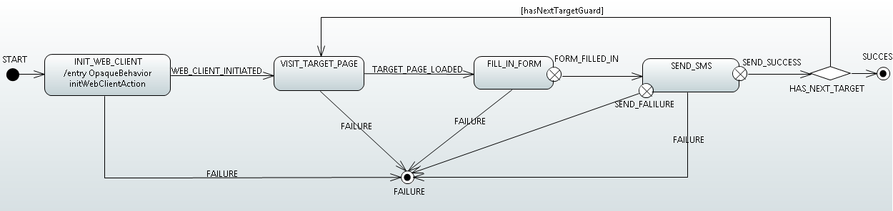

Yogg
============

[中文说明](https://www.joybean.org/2017/09/29/yogg-readme/)

Overview
--------
A simple,extensible SMS bomber written in Java.
Yogg takes advantage of SMS Gateway used by website to send verification code to target phone number.
A website store is necessary to launch it.Fetching every website from the website store,Yogg simulate manual operations on the website for the purpose of requesting a SMS sent to the target phone number as far as possible.

### Features
* Metadata driven architecture
* Flexible execution flow configuration
* Support multiple website store
* Visualized execution statistics
* Scheduling task(being developed)

### How it works

Yogg has a built-in browser that uses a state machine to describe the execution flow of sending SMS on a website through a browser.
Yogg will search for some of the necessary page elements from the website and perform certain actions against them.
The default execution flow is configured as follows:

A successful execution flow roughly includes the following actions:
* Initialize the browser
* Visit the target page (target page is a page maybe used for sending SMS,such as a registration page)
    - Initialize the home page
    - Click the relevant link on the home page to jump to the target page
* Fill in the form
    - Input the target phone number in the phone number field
    - Solve the captcha and input the captcha text
* Submit a request of sending SMS
    - Click the "Send SMS" button

Quick start
-----------
### Prerequisite

The only requirement to run Yogg is to have the Java Development Kit (JDK)
version 8 or above installed on your system which you can download from the below link.

[JDK download](http://www.oracle.com/technetwork/java/javase/downloads/index.html)

### Download
Go to the [release page](https://github.com/Joybeanx/yogg/releases) to download latest executable jar.

### Configuration
+ threads: the number of threads used for sending SMS,each website consumes a thread,default value:20
+ timeout: the timeout of attempt to send SMS by a website,default value:90000 ms
+ proxy: the proxy by which Yogg accesses website
    - type: the type of the proxy:direct,http,socks
    - host: the host of the proxy
    - port: the port of the proxy
+ DataSource:
    + Crawler: supply website collected by crawler
        - start url: the url with which crawler starts to collect website
    + File: supply website stored in file
        - file path: the local website file
    + Database:you should execute [SQL script](scripts "scripts") to initialize your database first
        - type: the data source type,currently only supports MySQL
        - username: the username of database
        - password: the password of database

### Startup
Open command line,enter the directory in which your executable jar located,run:

    java -jar yogg-${version}-RELEASE.jar

Building Yogg
-------------------
Yogg is built using [Apache Maven](http://maven.apache.org/).
To build Yogg, run:

    mvn -DskipTests clean package

The artifact will be generated in: target.

Limitations
-----------

* In view of the existence of an extremely variety of websites on the Internet, Yogg is definitely unable to adapt to of them.
 The execution flow with default configuration has a very limited capability, the page element matching rules apply only to the
 **Chinese website and Chinese phone number**.If there is any special requirement,please customize the execution flow and
 page element matching rules to increase Yogg accuracy rate.
* The built-in captcha recognition engine is [Tesseract](https://github.com/tesseract-ocr/tesseract). It seems that
Tesseract doesn't work well when it processes complex captcha,greatly impacting the effect of sending SMS,nevertheless,
Tesseract provides a training method can improve the recognition accuracy.
* As Yogg has no control over SMS gateway, so we can not customize SMS content.
* Frequent use of Yogg will lead to reduced utility. In order to prevent the abuse of sending SMS verification code,almost websites set
some strategies to control the sending frequency,such as limit the maximum number of times sending SMS for each ip per day. You can configure [Tor](https://www.torproject.org/)
as proxy to improve this situation.